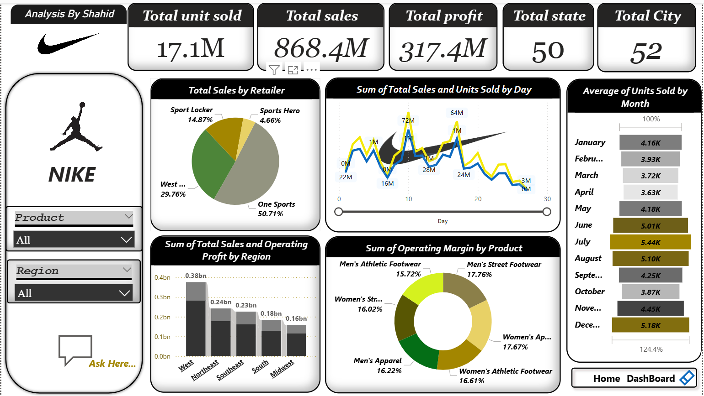

# Nike Sales Performance Dashboard (Power BI)
---

  

---

This interactive **Power BI dashboard** analyzes Nike's sales performance across different **retailers, regions, months, and product categories**. 
It provides data-driven insights into **total sales, profit, and unit trends**, 
helping understand which areas contribute most to revenue and where improvement is needed.

---

## 📊 Key Highlights

**Overall Performance**  
- **Total Units Sold:** 17.1 Million  
- **Total Sales:** $868.4 Million  
- **Total Profit:** $317.4 Million  
- Nike products are sold across **50 states** and **52 cities**, reflecting a strong nationwide presence.

**Retailer Performance**  
- **One Sports** dominates with **50.71%** of total sales.  
- **West Gear** holds **29.76%** share.  
- **Sport Locker** (14.87%) and **Sports Hero** (4.66%) contribute smaller portions.

**Regional Performance**  
- **West** leads with around **$380M** in total sales.  
- Other regions — Northeast ($240M), Southeast ($230M), South ($180M), and Midwest ($160M) — trail behind.

**Operating Margin by Product**  
- **Highest Margins:** Women’s Apparel (17.67%), Men’s Street Footwear (17.76%)  
- **Lowest Margin:** Men’s Athletic Footwear (15.72%)

**Monthly Sales Pattern**  
- **Peak Months:** July (5.44K avg. units), December (5.18K avg. units)  
- **Slow Months:** April (3.63K avg. units), March (3.72K avg. units)

---

 

---

## 📈 Visuals Used in Dashboard

| Visual Type             | Purpose                                                                 |
|-------------------------|-------------------------------------------------------------------------|
| **KPI Cards**           | Displayed Total Units Sold, Sales, Profit, States, Cities               |
| **Pie Chart**           | Total Sales by Retailer                                                 |
| **Line Chart**          | Sales & Units Sold by Day                                               |
| **Bar Chart**           | Total Sales & Profit by Region                                          |
| **Donut Chart**         | Operating Margin by Product                                             |
| **Horizontal Bar Chart**| Monthly Average Units Sold                                              |
| **Dropdown Filters**    | Filter by Product and Region for dynamic analysis                       |

---

## 🛠️ Tools Used

- Power BI (Dashboard Design & Data Modeling)
- Microsoft Excel (Data Preparation & Cleaning)

## 🔗 Project Overview

This project demonstrates real-time analytics using interactive visuals. It is ideal for tracking brand performance, 
optimizing marketing, and driving regional strategy.

---
## 📁 Files Included

- `Nike_Sales_Dashboard.pbix`  
- `Data source-` –   https://github.com/shahidali0101/Nike-Sales-Performance-Dashboard/blob/main/Nike%20Data.xlsx

-`[Dashboard preview image]-` -( https://github.com/shahidali0101/Nike-Sales-Performance-Dashboard/blob/main/Snapshot%20of%20the%20Dashboard.png )

## 📌 About the Creator

**Created by:** *Shahid Ali*          
**Role:** Aspiring Data Analyst  

⭐ *If you like this project, feel free to star 🌟 the repository.
